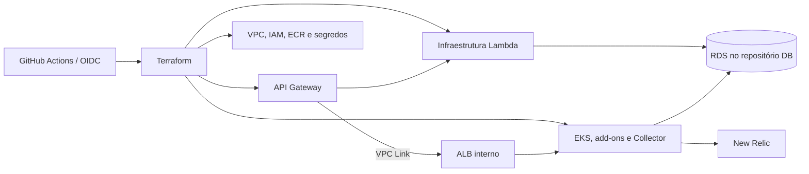

# FIAP Tech Challenge — Infraestrutura

Provisiona a plataforma AWS compartilhada: rede, EKS/ECR, API Gateway, infraestrutura da Lambda, segredos e observabilidade. RDS pertence ao [repositório de banco](https://github.com/Maieru/fiap-tech-challenge-db); aplicação e código da Lambda têm deploys próprios.

## Tecnologias e arquitetura

Terraform, AWS, Kubernetes, Helm, GitHub Actions/OIDC, External Secrets e OpenTelemetry/New Relic.



## Execução e deploy

Requer Terraform 1.13.x, AWS CLI autenticada e kubectl. Siga o [guia de infraestrutura](infra/README.md) para o bootstrap inicial, variáveis e comandos de cada estágio. Não há processo de aplicação local ou Dockerfile neste repositório.

Após o bootstrap, o ciclo de um estágio é:

```powershell
terraform -chdir=infra/aws-resources init
terraform -chdir=infra/aws-resources fmt -check
terraform -chdir=infra/aws-resources validate
terraform -chdir=infra/aws-resources plan -out=tfplan
terraform -chdir=infra/aws-resources apply tfplan
```

Forneça as variáveis indicadas no guia e não versione planos, credenciais ou tfvars sensíveis. A primeira implantação intercala o banco e a aplicação:

```text
bootstrap → aws-resources → database → kubernetes-addons
→ kubernetes-configs → aplicações/Ingresses → api-gateway → serverless
```

Depois, o repositório serverless publica o código da Lambda.

## CI/CD

Os [workflows](.github/workflows) executam os estágios por chamada reutilizável ou início manual. Configure `INFRA_ACTION_ROLE`, `jwt_signing_key`, `NEW_RELIC_LICENSE_KEY` e, para acesso privado entre repositórios, `REPOSITORIES_TOKEN`, conforme o workflow utilizado.

O apply é automático após plan. Deploy por branch de homologação/produção e proteção obrigatória de PR ainda precisam ser implementados ou comprovados; veja o [mapa de CI/CD](https://github.com/Maieru/fiap-tech-challenge/blob/main/docs/operacao/ci-cd.md).

## Observabilidade e APIs

Consulte [configuração e validação do New Relic](src/ObservabilityConfig/README.md). Para obter a URL do gateway após provisionamento:

```powershell
terraform -chdir=infra/api-gateway output -raw api_endpoint
```

Este repositório não expõe uma API própria. O contrato da aplicação está em [OpenAPI local](http://localhost:8080/openapi/v1.json), com [interface Scalar](http://localhost:8080/scalar/v1), quando executada em Development. O contrato da Lambda está no [README serverless](https://github.com/Maieru/fiap-tech-challenge-serverless#readme).

A infraestrutura atual é um laboratório efêmero. A [documentação central](https://github.com/Maieru/fiap-tech-challenge/blob/main/docs/README.md) contém componentes, sequências, ER, RFCs, ADRs e atendimento à Fase 3.